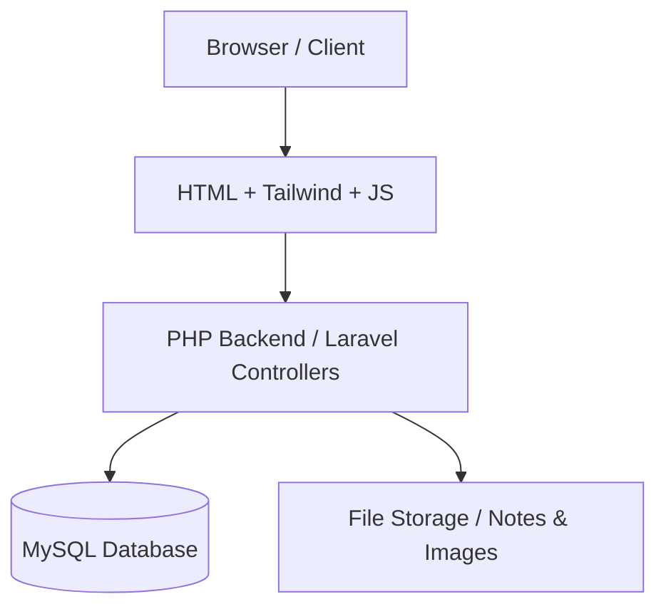

# 🏗️ 4. SYSTEM ARCHITECTURE

## Workflow Diagram

## Communication Style
*   **API Style:** Even in PHP/Laravel, the backend should expose RESTful endpoints for future-proofing.
*   **Endpoints Examples:**
    *   `GET /api/notes` - List/Filter notes
    *   `POST /api/posts` - Create community interaction
    *   `GET /api/chat` - Retrieve messages
