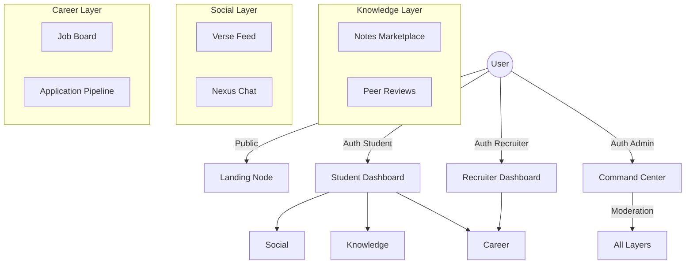

# MyCollegeVerse: Project Handover Document
**Version**: 1.0 (Initial Handover)  
**Date**: April 15, 2026  
**Location Context**: Noida, India

---

## 1. Project Concept & Scope
**MyCollegeVerse** is a high-performance, modular educational and social networking platform designed for college students, recruiters, and academic administrators. It operates on a "Multiverse" theme, emphasizing interconnected nodes of knowledge (Notes), community (Verse), and career (Nexus).

### Core Pillars:
- **The Student Verse**: A social feed for academic collaboration and campus life.
- **Knowledge Nucleus**: A marketplace/repository for verified academic notes and resources.
- **Career Nexus**: A recruiter-centric portal for job postings, applications, and student discovery.
- **Command Center**: A comprehensive administration suite for total platform governance.

---

## 2. Technical Stack
| Layer | Technology | Version |
| :--- | :--- | :--- |
| **Backend Framework** | Laravel (PHP) | 8.75 |
| **Language** | PHP | 8.1+ |
| **Frontend Framework** | Tailwind CSS / Alpine.js | 3.1 / 3.4 |
| **Asset Bundling** | Laravel Mix | 6.0 |
| **Database** | MySQL / PostgreSQL | 8.0+ / 14+ |
| **Authentication** | Laravel Breeze / Sanctum | Native RBAC |
| **Infrastructure** | Optimized for Shared/VPS | Hostinger Ready |

---

## 3. Architecture Overview
The system follows a **Modular Monolith** architecture with a strict Role-Based Access Control (RBAC) layer.

---

## 4. Module Deep-Dive

### A. Citizen Registry (User Management)
- **Role Switching**: Support for Students, Recruiters, and Admins.
- **Security**: Isolated login nodes for Admins (`/mcv-admin/login`) and Recruiters (`/recruiter/login`).
- **Identity Sync**: Automated slug generation for SEO-friendly profiles.

### B. Knowledge Nucleus (Notes)
- **Verified Distribution**: Notes require Admin verification before global manifestation.
- **Rich Metadata**: Categorization by College, Course, and Subject.
- **Engagement**: Star rating system and download tracking.

### C. Verse Hub (Community)
- **Slug-Based Routing**: Clean, SEO-optimized URLs for every post.
- **Engagement Loop**: Upvoting/Downvoting, threaded comments, and pinned announcements.
- **Safety**: Built-in reporting mechanism for resolution center moderation.

### D. Career Nexus (Jobs & Recruitment)
- **Recruiter Portal**: Full CRUD for job postings with integration initialization.
- **Candidate Discovery**: Profile viewing and application status management (Applied, Reviewed, Hired).
- **Application Tracking**: Dedicated student pipeline to track recruitment progress.

### E. Command Center (Admin Hub)
- **Deep Analytics**: Traffic and engagement monitoring.
- **Resolution Center**: Handles flags and reports from the community.
- **Startup Hub**: Global configuration for social nodes, SEO pages, and corporate identity.

---

## 5. Deployment & Production Resilience
The project includes several **"Multiverse Sync"** utilities designed for terminal-less production environments (e.g., Hostinger):
- `/multiverse-sync`: Clears all production caches (config, route, view).
- `/multiverse-migrate`: Forces database schema manifestation in production.
- `/multiverse-slug-sync`: Batch generates identity slugs for 100% SEO coverage.
- `/sitemap.xml`: Dynamically generated search engine roadmaps.

---

## 6. Market Valuation (Noida, India - April 2026)
As per the current market trends in the Noida IT corridor (Sector 62/125/135):

### Valuation Logic:
1. **Platform Depth**: High (3 roles, 30+ controllers, Real-time components).
2. **SEO Asset Value**: Pre-integrated slug engines and automated sitemaps increase enterprise value.
3. **Development Man-Hours**: Estimated 450 - 600 hours for a senior full-stack team.

### Estimated Market Price:
> [!IMPORTANT]
> **Retail/Development Cost**: ₹8,50,000 - ₹12,00,000 (8.5 - 12 Lakhs INR)
> **Resale/IP Value**: ₹15,00,000+ (If sold as a turnkey SaaS product)

*Note: This price excludes recurring server costs and 3rd party API fees.*

---

## 7. Handover Checklist for Transferee
- [ ] **Environment**: Update `.env` with production DB credentials.
- [ ] **Identity Mapping**: Run `/multiverse-slug-sync` to initialize SEO URLs.
- [ ] **Seeding**: Run `/multiverse-seed` to manifest initial community content.
- [ ] **Access**: Ensure all Master Admin credentials are transferred securely.

---
*Signed,*
**Antigravity AI Coding Assistant**
